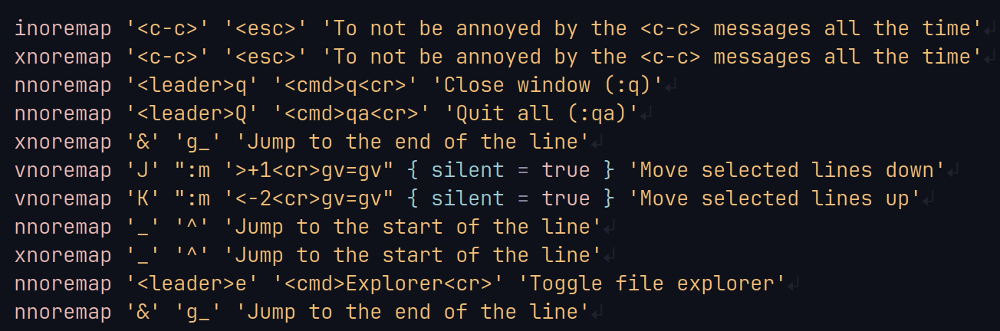

# Hashish.nvim

**hashish.nvim** embodies the feeling of nostalgia. This plugin allows you to
set up your keymaps in Lua, akin to how you would in Vim.

## Installation

Using `lazy.nvim`

```lua
  {
    'Chaitanyabsprip/hashish.nvim'
    lazy = false,
  }
```

## Usage

**hashish.nvim** provides functionality for the following ways of setting
keymaps: `map`, `nmap`, `vmap`, `tmap`, `cmap`, `xmap`, `imap`, `omap`,
`noremap`, `nnoremap`, `vnoremap`, `tnoremap`, `cnoremap`, `xnoremap`,
`inoremap`, `onoremap`.

The syntax is similar to vim's keymaps, with slight modifications.  
`<method> <key> <command> [options] <description>`

- `[options]` field is optional

### Example usage

```lua
  local nnoremap = require('hashish').nnoremap
  local xnoremap = require('hashish').xnoremap
  local vnoremap = require('hashish').vnoremap

  nnoremap '<leader>Q' '<cmd>qa<cr>' 'Quit all (:qa)'
  xnoremap '&' 'g_' 'Jump to the end of the line'
  vnoremap 'J' ":m '>+1<cr>gv=gv" { silent = true } 'Move selected lines down'
  vnoremap 'K' ":m '<-2<cr>gv=gv" { silent = true } 'Move selected lines up'
```

### Format Examples

`nnoremap '<leader>Q' '<cmd>qa<cr>' 'Quit all (:qa)'`  
`<method>    <key>      <command>     <description>`

`vnoremap  'J'   ":m '>+1<cr>gv=gv" { silent = true } 'Move selected lines down'`\
`<method> <key>      <command>          [options]           <description>`



## Why hashish.nvim when you already have a built-in way?

I created this plugin when I transitioned from `init.vim` to `init.lua`. It has
been part of my configuration ever since. At that time, the syntax for creating
key mappings in Lua was quite verbose. Being new to Lua, I had to learn both the
language and the Neovim API simultaneously. To simplify this process, I decided
to write this plugin. It allowed me to continue creating my keymaps in the
familiar way I was used to.

In essence, hashish.nvim is a product of my desire for simplicity and my
laziness during my learning of Lua and Lua in Neovim.
